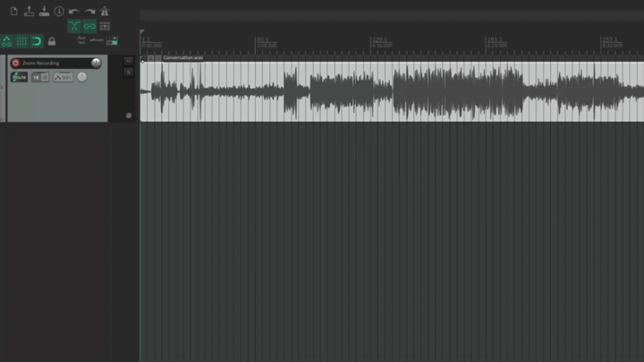

# REAPER Diarization Script


A Python script that performs **speech diarization** (speaker identification) in the current REAPER project, automatically splitting a single mixed recording onto new, colour-coded tracks for each unique speaker.

---

## Features

This script uses the [`senko`](github.com/narcotic-sh/senko) library for diarization and [`reapy`](https://github.com/RomeoDespres/reapy) to interact with REAPER.

1.  **REAPER Integration:** Automatically connects to a running REAPER instance and targets the first media item on the first track.
2.  **Format Check & Conversion:** Uses **`ffmpeg-python`** to check if the source audio is in the required 16kHz, mono, 16-bit PCM WAV format. If not, it converts it to a temporary file before processing, ensuring compatibility.
3.  **Individual Tracks:** Creates a new, unique track for every detected speaker and assigns a distinct colour.
4.  **Item Splitting:** Splits the original media item and moves the resulting segments to the corresponding speaker tracks.
5.  **Caching:** Supports saving and loading diarization results to a JSON file to avoid re-running the heavy diarization process.

---

## Setup and Installation

### Prerequisites

* [REAPER](https://www.reaper.fm/), with [`reapy`](https://github.com/RomeoDespres/reapy) set up
* [uv](https://docs.astral.sh/uv/) for Python virtual environment management
* [ffmpeg](https://ffmpeg.org/download.html) installed in your $PATH

### Steps

1.  **Clone the Repository:**
    ```bash
    git clone https://github.com/atmosfar/reaper_speech_diarizer.git
    cd reaper_speech_diarizer
    ```

2.  **Create and Activate Virtual Environment:**
    ```bash
    uv venv --python 3.11.13
    source .venv/bin/activate
    ```

3.  **Install Dependencies:**
    ```bash
    uv pip install -r requirements.txt
    ```

---

## Usage

The script must be run from your terminal/command line **outside** of REAPER, but while a REAPER project is open. It will automatically connect to REAPER using the `reapy` library.

**1. Prepare Your REAPER Project:**
* Ensure the audio you want to diarize is the **first item** on the **first track** of your active REAPER project.
* Save your REAPER project.

**2. Run the Script:**

The primary script is named `reaper_speech_diarization.py`.

* **To Run Full Diarization:**
    ```bash
    python reaper_speech_diarization.py
    ```

* **To Run and Save Results to a JSON Cache:**
    ```bash
    python reaper_speech_diarization.py --json_output results/my_diarization_cache.json
    ```

* **To Load Results from a JSON Cache (skips diarization):**
    ```bash
    python reaper_speech_diarization.py --json_input results/my_diarization_cache.json
    ```
